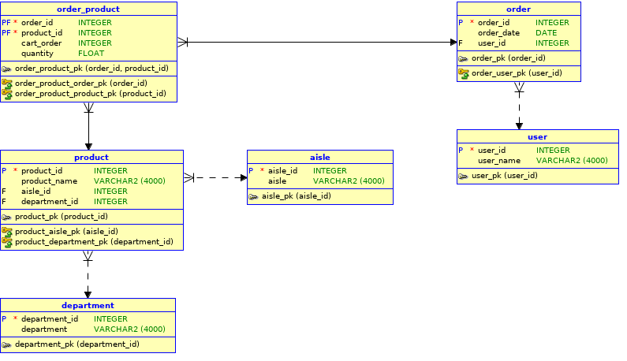

# retailsim-database
My retail simulation project database codes

This project uses postgres as rdbms.

## Commands

1. Create a postgres database somewhere
2. Log in and create retail database using `create_db.sql`
3. Change connection to new database and executes `update_at_trigger.sql`to create the update_at trigger
4. Executes the `create_tables.sql` to create the schemas and tables
5. Run `bash dump_data.sh HOST PORT DATABASE USER PASSWORD` to dump initial data.

## Schema

